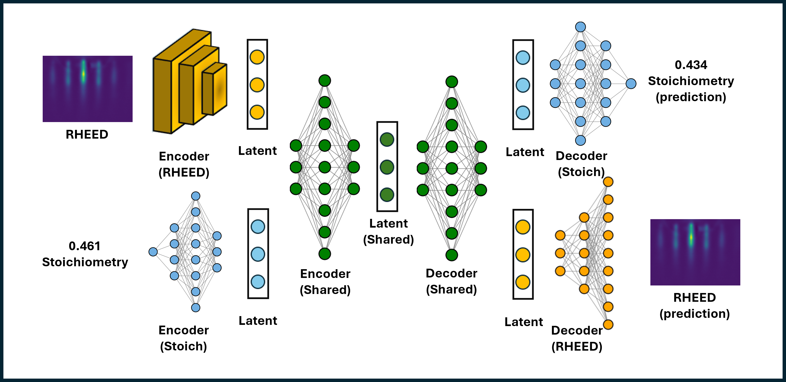

# 🧬 RHEED Universal Translator  
**Universal Translation Between RHEED Images and Stoichiometry**

> 🏆 Microscopy Hackathon 2025

---

## 🚀 Overview

**RHEED Universal Translator** is a deep-learning framework that enables **bi-directional translation** between:

- 📸 **RHEED images → stoichiometry**
- 🧪 **Stoichiometry → RHEED images**

Unlike traditional one-way predictors, this project learns a **shared latent representation** that supports both **forward** and **inverse** modeling. The entire workflow is wrapped in a **no-code Streamlit UI**, allowing users to explore predictions without writing any code.

> **✨ Key idea:** This work demonstrates bidirectional inference in thin-film growth by jointly learning from **RHEED images** and **XPS-derived stoichiometry** for the **SrTiO₃** material system. By enforcing a shared latent representation, the approach lays the foundation for **closed-loop** and **inverse-design microscopy workflows**, and can be generalized to **arbitrary ABO₃ oxide systems** as more data become available.

---

## 🧠 Scientific Background

This project builds upon the work:

> **Sumner Harris et al.**  
> *Deep learning with reflection high-energy electron diffraction images to predict cation ratio in Sr₂ₓTi₂(1−x)O₃ thin films*  
> 📄 https://arxiv.org/abs/2501.18523  
> 💻 https://github.com/sumner-harris/Deep-Learning-with-RHEED

The original study demonstrated **forward prediction**:

> **RHEED → stoichiometry**

---

### 🔄 Hackathon Extension

For **Microscopy Hackathon 2025**, we extend the original work into a **universal translator** capable of:

- **RHEED → Stoichiometry**  
- **Stoichiometry → RHEED**  
- **RHEED → RHEED** (image reconstruction)  
- **Stoichiometry → Stoichiometry** (self-consistency reconstruction)

This enables inverse generation, consistency checks, and improved interpretability across modalities, all exposed through an interactive, no-code interface.

---

## 📂 Repository Structure

```
rheed-universal-translator/
├── app.py                  # Demo UI (no-code interface)
├── models.py               # Universal Translator architecture
├── utils.py                # Utilities
├── requirements.txt        # Reproducible environment
├── inputs/
│   └── rheed_stoich_data.npz   # RHEED images + stoichiometry dataset
├── outputs/
│   ├── model_weights.pth       # Pretrained model weights (downloaded automatically)
│   └── model_meta.npz          # Metadata
├── 1_explore_data.ipynb     # Data visualization & inspection
├── 2_build_model.ipynb      # Full training pipeline
├── 3_evaluate_model.ipynb   # Model evaluation
└── README.md

```

---

## 📊 Dataset

The dataset used in this project is provided as:

**`inputs/rheed_stoich_data.npz`**

```python
loaded_data = np.load("inputs/rheed_stoich_data.npz")
stoich = loaded_data["stoich"].astype(np.float32)
images = loaded_data["images"].astype(np.float32)
```

- **Total samples:** 31 paired measurements  
- Each sample contains:
  - 📸 One RHEED image  
  - 🧪 One corresponding stoichiometry value  

⚠️ *Note:* This dataset is relatively small for deep learning models and is used primarily to demonstrate the modeling pipeline and universal translation concept. Model performance is expected to improve as more data becomes available.

---

## 🏗️ Model Architecture

The Universal Translator is built around a shared latent-space architecture consisting of:

- Separate encoders for **RHEED images** and **stoichiometry**
- A **shared latent representation** enabling cross-modal translation
- Dual decoders for:
  - Latent → RHEED image
  - Latent → stoichiometry

This design enables both forward and inverse translation while enforcing self-consistency across modalities.

<p align="center">
  
</p>

---

## 📓 Notebooks

### `1_explore_data.ipynb`
- Visualize RHEED images and inspect corresponding stoichiometry values

### `2_build_model.ipynb`
- Complete model training pipeline
- Uses an 80% training split (24 samples)
- Saves pretrained model weights and metadata

### `3_evaluate_model.ipynb`
- Demonstrates:
  - RHEED → Stoichiometry prediction
  - Stoichiometry → RHEED image generation
- Visualizes reconstruction and translation results

---

## 🎛️ User Interface

The **application (`app.py`)** provides a fully **no-code interface** for interacting with the RHEED Universal Translator using **Streamlit**.

### 🔁 RHEED → Stoichiometry
- Select a RHEED image from the provided dataset **or upload a custom RHEED image**
- The model predicts:
  - the corresponding **stoichiometry**
  - a **reconstructed RHEED image** (image → image)

### 🔁 Stoichiometry → RHEED
- Select a stoichiometry value from the dataset **or enter a custom value**
- The model generates:
  - a **predicted RHEED image**
  - a **reconstructed stoichiometry** (stoichiometry → stoichiometry)

⚠️ *Note:* Custom stoichiometry inputs are restricted to the range of the training dataset to avoid unreliable extrapolation.

---

## ⚡ Installation

### Tested Environment
- **Python**: 3.11.14  
- **uv**: 0.9.11  

### 1️⃣ Install `uv` (if not already installed)
```bash
pip install uv
```

### 2️⃣ Create and activate a virtual environment (recommended)

**On macOS / Linux**
```bash
uv venv
source .venv/bin/activate
```

**On Windows**

**PowerShell**
```powershell
uv venv
.\.venv\Scripts\Activate.ps1
```

**Command Prompt**
```cmd
uv venv
.venv\Scripts\activate.bat
```

### 3️⃣ Install dependencies
```bash
uv pip install -r requirements.txt
```

### 4️⃣ Run the application
```bash
streamlit run app.py
```

On first run, the application will automatically:

- Download the pretrained model weights (~193 MB — may take a few minutes depending on internet speed)
- Load model metadata and the dataset
- Launch the interactive UI (user interface)

---

## 🔗 Pretrained Model Weights

The pretrained model used by the Streamlit app is hosted on GitHub Releases:

👉 **Download link:**  
https://github.com/hasanjawad001/rheed-universal-translator/releases/download/v1.0/model_weights.pth

- File size: ~193 MB
- Automatically downloaded by the app on first run
- Loaded in the background (no manual steps required)

---

## 🌱 Potential Future Directions

- Scale to larger RHEED datasets  
- Extend to additional materials systems  
- Uncertainty-aware predictions  
- Multi-modal extensions (RHEED + XRD + Raman)
- Closed-loop experiment steering and inverse design

---

## 🙌 Acknowledgements

This work builds upon and is inspired by:

- **Sumner Harris et al.**, *Deep Learning with RHEED*  
- **Microscopy Hackathon 2025** organizers and community  

### Hackathon Contributors
This project was developed during **Microscopy Hackathon 2025** by:

- **Jawad Chowdhury** — Oak Ridge National Laboratory (ORNL)  
- **Asraful Haque** — Oak Ridge National Laboratory (ORNL)

---

## ⭐ Like This Project?

If you found **RHEED Universal Translator** useful or inspiring:

👉 **Please give this repository a ⭐ on GitHub!**

Happy Hackathon! 🥳  
Let’s build the future of **AI-driven microscopy** together.
